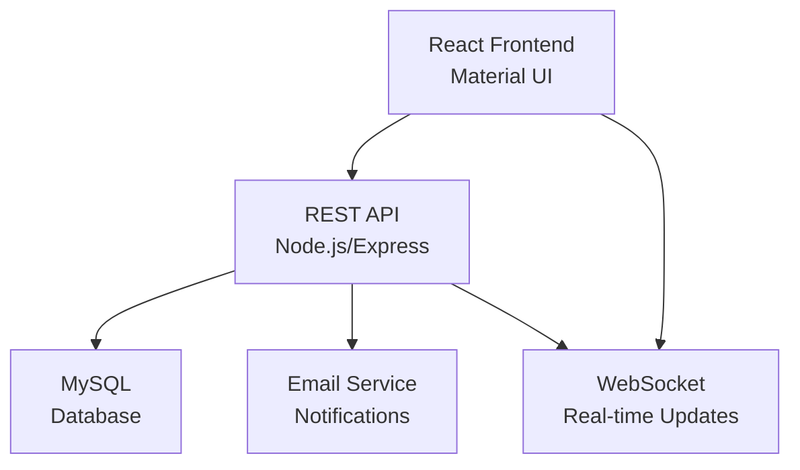

# Design Document

## Overview

Das Ticketsystem wird als moderne, dreischichtige Webanwendung entwickelt, bestehend aus einem React-Frontend mit Material UI, einer Node.js/Express REST API und einer MySQL-Datenbank. Die Architektur folgt dem Prinzip der Separation of Concerns und ermöglicht eine klare Trennung zwischen Präsentationsschicht, Geschäftslogik und Datenhaltung.

## Architecture

### High-Level Architecture



### Technology Stack

**Frontend:**
- React 18 mit TypeScript für Type Safety
- Material UI v5 für konsistente UI-Komponenten
- React Router für Navigation
- Axios für HTTP-Requests
- Socket.io-client für Real-time Updates

**Backend:**
- Node.js mit Express Framework
- TypeScript für bessere Wartbarkeit
- Socket.io für WebSocket-Verbindungen
- Nodemailer für E-Mail-Benachrichtigungen
- JWT für Authentifizierung
- Joi für Request-Validierung

**Database:**
- MySQL für relationale Datenstruktur
- Prisma ORM für Type-safe Database Access

## Components and Interfaces

### Frontend Components

#### Core Components
- **TicketList**: Übersicht aller Tickets mit Filterung und Sortierung
- **TicketDetail**: Detailansicht eines Tickets mit Kommentaren
- **TicketForm**: Formular zur Ticket-Erstellung und -bearbeitung
- **CommentSection**: Kommentarbereich mit chronologischer Anzeige
- **StatusBadge**: Visuelle Darstellung des Ticket-Status
- **AssigneeSelector**: Dropdown zur Bearbeiter-Auswahl
- **NotificationCenter**: Benachrichtigungsbereich

#### Layout Components
- **AppLayout**: Hauptlayout mit Navigation und Header
- **Sidebar**: Navigationsmenü mit Ticket-Kategorien
- **Header**: Kopfbereich mit Benutzerinformationen

### Backend API Endpoints

#### Ticket Management
```
GET    /api/tickets           - Liste aller Tickets
GET    /api/tickets/:id       - Einzelnes Ticket mit Details
POST   /api/tickets           - Neues Ticket erstellen
PUT    /api/tickets/:id       - Ticket aktualisieren
DELETE /api/tickets/:id       - Ticket löschen
```

#### Comment Management
```
GET    /api/tickets/:id/comments    - Kommentare eines Tickets
POST   /api/tickets/:id/comments    - Neuen Kommentar hinzufügen
PUT    /api/comments/:id            - Kommentar bearbeiten
DELETE /api/comments/:id            - Kommentar löschen
```

#### User Management
```
GET    /api/users             - Liste aller Benutzer
GET    /api/users/:id         - Einzelner Benutzer
POST   /api/auth/login        - Benutzer-Anmeldung
POST   /api/auth/logout       - Benutzer-Abmeldung
```

## Data Models

### Ticket Model
```typescript
interface Ticket {
  id: string;
  title: string;
  description: string;
  status: 'open' | 'in_progress' | 'closed';
  priority: 'low' | 'medium' | 'high' | 'urgent';
  createdBy: string;
  assignedTo?: string;
  createdAt: Date;
  updatedAt: Date;
  comments: Comment[];
}
```

### Comment Model
```typescript
interface Comment {
  id: string;
  ticketId: string;
  content: string;
  authorId: string;
  createdAt: Date;
  updatedAt: Date;
}
```

### User Model
```typescript
interface User {
  id: string;
  email: string;
  firstName: string;
  lastName: string;
  role: 'user' | 'agent' | 'admin';
  isActive: boolean;
  createdAt: Date;
}
```

### Database Schema
```sql
-- Users table
CREATE TABLE users (
  id VARCHAR(36) PRIMARY KEY DEFAULT (UUID()),
  email VARCHAR(255) UNIQUE NOT NULL,
  first_name VARCHAR(100) NOT NULL,
  last_name VARCHAR(100) NOT NULL,
  role ENUM('user', 'agent', 'admin') DEFAULT 'user',
  is_active BOOLEAN DEFAULT true,
  created_at TIMESTAMP DEFAULT CURRENT_TIMESTAMP
);

-- Tickets table
CREATE TABLE tickets (
  id VARCHAR(36) PRIMARY KEY DEFAULT (UUID()),
  title VARCHAR(255) NOT NULL,
  description TEXT NOT NULL,
  status ENUM('open', 'in_progress', 'closed') DEFAULT 'open',
  priority ENUM('low', 'medium', 'high', 'urgent') DEFAULT 'medium',
  created_by VARCHAR(36),
  assigned_to VARCHAR(36),
  created_at TIMESTAMP DEFAULT CURRENT_TIMESTAMP,
  updated_at TIMESTAMP DEFAULT CURRENT_TIMESTAMP ON UPDATE CURRENT_TIMESTAMP,
  FOREIGN KEY (created_by) REFERENCES users(id),
  FOREIGN KEY (assigned_to) REFERENCES users(id)
);

-- Comments table
CREATE TABLE comments (
  id VARCHAR(36) PRIMARY KEY DEFAULT (UUID()),
  ticket_id VARCHAR(36),
  content TEXT NOT NULL,
  author_id VARCHAR(36),
  created_at TIMESTAMP DEFAULT CURRENT_TIMESTAMP,
  updated_at TIMESTAMP DEFAULT CURRENT_TIMESTAMP ON UPDATE CURRENT_TIMESTAMP,
  FOREIGN KEY (ticket_id) REFERENCES tickets(id) ON DELETE CASCADE,
  FOREIGN KEY (author_id) REFERENCES users(id)
);
```

## Error Handling

### Frontend Error Handling
- **Global Error Boundary**: Fängt unerwartete React-Fehler ab
- **API Error Interceptor**: Zentrale Behandlung von HTTP-Fehlern
- **Form Validation**: Client-seitige Validierung mit Material UI
- **Toast Notifications**: Benutzerfreundliche Fehlermeldungen

### Backend Error Handling
- **Global Error Middleware**: Zentrale Fehlerbehandlung
- **Request Validation**: Joi-Schema-Validierung für alle Endpoints
- **Database Error Handling**: Spezifische Behandlung von DB-Fehlern
- **Logging**: Strukturiertes Logging mit Winston

### Error Response Format
```typescript
interface ErrorResponse {
  success: false;
  error: {
    code: string;
    message: string;
    details?: any;
  };
  timestamp: string;
}
```

## Testing Strategy

### Frontend Testing
- **Unit Tests**: Jest + React Testing Library für Komponenten
- **Integration Tests**: Testing von Component-Interaktionen
- **E2E Tests**: Cypress für End-to-End-Szenarien
- **Visual Regression Tests**: Storybook für UI-Komponenten

### Backend Testing
- **Unit Tests**: Jest für Service- und Utility-Funktionen
- **Integration Tests**: Supertest für API-Endpoint-Tests
- **Database Tests**: In-Memory-Database für isolierte Tests
- **Load Tests**: Artillery für Performance-Tests

### Test Coverage Goals
- Mindestens 80% Code Coverage für kritische Pfade
- 100% Coverage für Geschäftslogik-Services
- Automatisierte Tests in CI/CD-Pipeline

### Testing Environment
- **Development**: Lokale Test-Database
- **Staging**: Produktionsähnliche Umgebung
- **CI/CD**: Docker-Container mit Test-Services

## Security Considerations

### Authentication & Authorization
- JWT-basierte Authentifizierung
- Role-based Access Control (RBAC)
- Session-Management mit sicheren Cookies

### Data Protection
- Input-Sanitization gegen XSS
- SQL-Injection-Schutz durch ORM
- CORS-Konfiguration für API-Zugriff
- Rate Limiting für API-Endpoints

### Infrastructure Security
- HTTPS-Verschlüsselung
- Environment-basierte Konfiguration
- Sichere Passwort-Hashing (bcrypt)
- Database-Verbindung über SSL